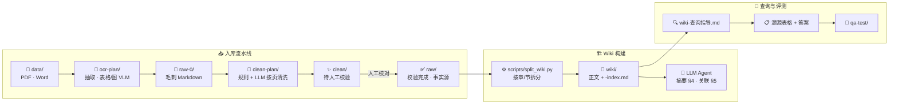

# 📚 policy-llm-wiki

> 面向 **医疗器械 / 药品监管** 等政策法规场景的 [LLM-Wiki](./llm-wiki-instruction.simple.zh-CN.md) 知识库：从 PDF/Word 抽取、清洗、人工校验，到按章拆分的可查询 Wiki；问答 **只读 `wiki/`**，并以 **可溯源条文表格** 约束幻觉。

[](LICENSE)
[](https://www.python.org/)
[](./wiki/)

---

## ✨ 为什么用 LLM-Wiki，而不是「上传 PDF 就 RAG」？

| 方式 | 特点 |
| --- | --- |
| 传统 RAG | 每次提问重新检索片段，知识不沉淀，长法规易撑爆上下文 |
| **本仓库 LLM-Wiki** | 原文 **整理一次** 写入 `wiki/`；查询时读 **索引 + 正文**；答题强制 **原文摘抄 + 路径 + 条号/页码** |

核心约定：

- 📄 **事实源**：人工校验后的 `raw/`（导入 wiki 时 agent 只读）
- 🔍 **查询层**：`wiki/`（问答 **禁止** 回读 `data/`、`raw-0/`、`clean/`、`raw/`）
- 🧾 **可溯源**：先填「关键溯源条文」表格（§6.2），再写面向客户的归纳答案（§6.4，见 [`wiki-查询指导.md`](./wiki-查询指导.md)）

---

## 🖼️ 可溯源问答

| 能力 | 说明 |
| --- | --- |
| 📂 结构化 Wiki | 规范 → 章 → 节；每文件配套 `-index.md`（条目录 + 摘要） |
| 🔗 交叉引用 | `## 关联文件` 链到相关规范章节 |
| 📋 溯源表格 | `序号 \| 规范 \| 条号 \| 页码 \| wiki 路径 \| 原文摘抄` |
| ✅ 评测闭环 | `qa-test/` 模板 + `evaluate.md` 逐行核对摘抄是否在 wiki 中存在 |

示例格式见 [`qa-test/answer-example.md`](./qa-test/answer-example.md)。

---

## 🔄 端到端流水线（从 PDF 到可查询 Wiki）



| 阶段 | 目录 / 工具 | 角色 |
| ---: | --- | --- |
| 0️⃣ | `data/` | 原始 PDF/Word，**只读** |
| 1️⃣ | [`ocr-plan/`](./ocr-plan/README.md) | 正文 `pdfplumber`、表格/图片多模态 LLM；页末 `<!-- 第 N 页 -->` |
| 2️⃣ | `raw-0/` | 抽取产物（含 OCR 毛刺） |
| 3️⃣ | [`clean-plan/`](./clean-plan/README.md) | 标题层级、加粗、页码噪声；按页 LLM 清洗 |
| 4️⃣ | `clean/` | 自动清洗输出，**待人工校验** |
| 5️⃣ | `raw/` | ★ 校验后的最终 Markdown，wiki **唯一事实输入** |
| 6️⃣ | [`scripts/`](./scripts/README.md) | `split_wiki.py` / `batch_split_wiki.py` 确定性拆分 |
| 7️⃣ | `wiki/` | ★ 可查询知识库（agent 维护：摘要、关联、索引） |
| 8️⃣ | [`qa-test/`](./qa-test/README.md) | 命题、答题、评测、防幻觉核对 |

> `data/`、`raw-0/`、`clean/` 及两个 `*-plan/` 子项目 **不参与查询**，避免上下文膨胀与「每次重新读 100 页法规」。

---

## 📁 仓库结构

```
policy-llm-wiki/
├── 📁 data/                 # 原始 PDF / Word
├── 🔬 ocr-plan/             # 抽取流水线
├── 📝 raw-0/                # 抽取输出
├── 🧹 clean-plan/           # 清洗流水线
├── ✨ clean/                # 清洗输出（待校验）
├── ✅ raw/                  # 人工校验完成 · 事实源
├── 📖 wiki/                 # 拆分后的 LLM-Wiki（查询层）
├── ⚙️ scripts/              # split_wiki、行数检查、页码修正等
├── 🧪 qa-test/              # 测试题与评估模板
├── 📄 wiki-拆分指导.md      # 拆分、摘要、关联规则 + Agent 工作流 §7～§8
├── 📄 wiki-查询指导.md      # 查询与答题格式（含溯源表格 §6）
├── 📄 常用提示词汇总.md      # 常用任务短指令（可复制）
├── 🤖 AGENTS.md / CLAUDE.md # Agent 工作守则
├── 📘 llm-wiki-instruction.simple.zh-CN.md
└── 🖼️ docs/images/          # README 效果展示截图（见 docs/images/README.md）
```

---

## 🚀 快速开始

### 1️⃣ 环境

```bash
conda create -n policy-wiki python=3.10 -y
conda activate policy-wiki
pip install -r ocr-plan/requirements.txt
# clean-plan 依赖见 clean-plan/requirements.txt（若单独维护）
```

API / 模型配置：`ocr-plan/config.py`、`clean-plan/config.py`。

### 2️⃣ 抽取：`data/` → `raw-0/`

```bash
# 处理 data/ 下全部文档
python ocr-plan/main.py

# 单文件 / 跳过多模态
python ocr-plan/main.py --file data/某规范.pdf
python ocr-plan/main.py --no-vlm
```

详见 [`ocr-plan/README.md`](./ocr-plan/README.md)。

### 3️⃣ 清洗：`raw-0/` → `clean/`

```bash
python clean-plan/main.py
python clean-plan/main.py --file raw-0/某规范.md
python clean-plan/main.py --rules-only    # 仅本地规则
python clean-plan/main.py --overwrite
```

汇总报告：`clean/_clean_report.md`。详见 [`clean-plan/README.md`](./clean-plan/README.md)。

### 4️⃣ 人工校验 → `raw/`

对 `clean/` 中 Markdown 校对 **章节标题、表格、关键条款**，确认无误后移入 `raw/`。此后以 `raw/` 为 wiki 事实源，不再回改上游产物。

### 5️⃣ 拆分 → `wiki/` + LLM 补全

```bash
# 单部规范
python scripts/split_wiki.py raw/药物警戒质量管理规范.md
python scripts/count_split_lines.py raw/药物警戒质量管理规范.md

# 批量
python scripts/batch_split_wiki.py
```

脚本生成正文与占位 `-index.md`（`TODO: 待LLM总结`）。再由 LLM 按 [`wiki-拆分指导.md`](./wiki-拆分指导.md) **§4 条文摘要 → §5 关联文件** 补全；提示词见该文档 **§8**。

### 6️⃣ 查询 / 答题 / 评测

- 查询：只读 `wiki/`，遵循 [`wiki-查询指导.md`](./wiki-查询指导.md)
- 答题：[`qa-test/question-template.md`](./qa-test/question-template.md) → 先 **溯源表格**，后 **答案**
- 评测：[`qa-test/evaluate.md`](./qa-test/evaluate.md)、[`qa-test/check-answer-against-wiki.md`](./qa-test/check-answer-against-wiki.md)

---

## 🤖 给 Coding Agent

| 工具 | 守则文件 |
| --- | --- |
| Claude Code | [`CLAUDE.md`](./CLAUDE.md) |
| Cursor / Codex 等 | [`AGENTS.md`](./AGENTS.md) |

导入新规范：**`raw/` 已就绪** → `split_wiki` → LLM 按 `wiki-拆分指导.md` 补摘要与关联。  
用户提问：**只查 `wiki/`**，输出含溯源表格的答案。

---

## 📖 文档索引

| 文档 | 用途 |
| --- | --- |
| [llm-wiki-instruction.simple.zh-CN.md](./llm-wiki-instruction.simple.zh-CN.md) | LLM-Wiki 模式总述 |
| [wiki-拆分指导.md](./wiki-拆分指导.md) | 拆分规则、索引格式、Agent §8 提示词 |
| [wiki-查询指导.md](./wiki-查询指导.md) | 查询流程、溯源表格答题 §6 |
| [scripts/README.md](./scripts/README.md) | 脚本说明与行数抽查 |
| [qa-test/README.md](./qa-test/README.md) | 测试集与评测流程 |
| [docs/images/README.md](./docs/images/README.md) | 效果展示截图清单 |

---

## 📌 当前状态

| 模块 | 状态 |
| --- | --- |
| `ocr-plan/` 抽取 | ✅ 可用 |
| `clean-plan/` 清洗 | ✅ 可用 |
| `scripts/` 拆分与检查 | ✅ 可用 |
| `wiki/` 知识库 | 🚧 按规范持续导入 |
| `qa-test/` 评测模板 | ✅ 含溯源表格规范 |
| `docs/images/` 演示图 | 📷 待补充截图 |

---

## 🤝 贡献与许可

欢迎通过 Issue / PR 补充规范、修正 wiki 条目或完善流水线。许可文件待定（`LICENSE`）。

---

<p align="center">
  <sub>政策法规类文档：条款 · 定义 · 时限 · 法律依据 — 保留在正文，不被摘要稀释。</sub>
</p>
