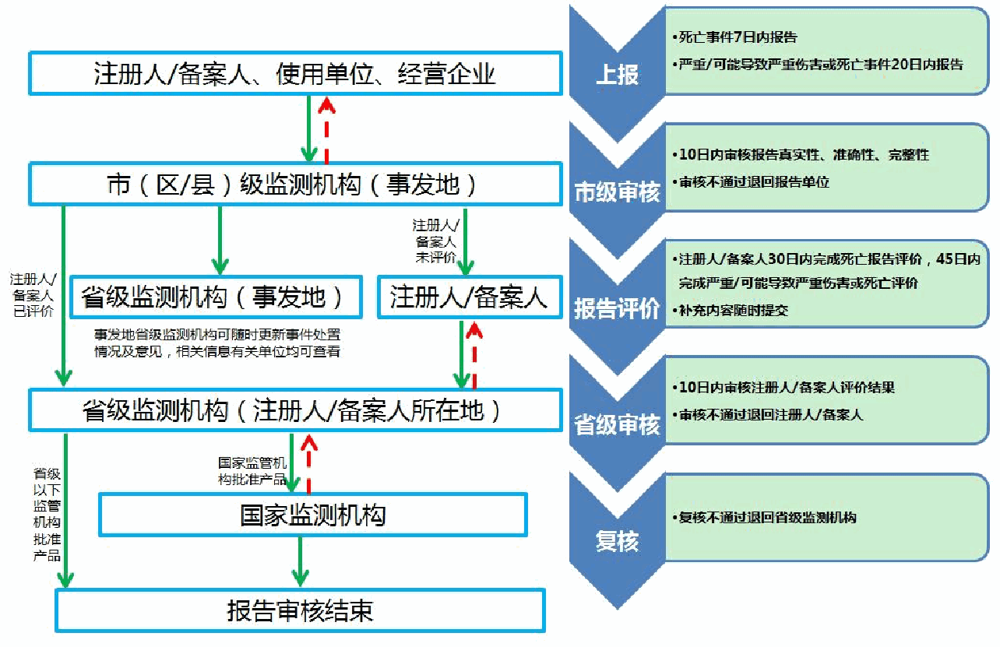
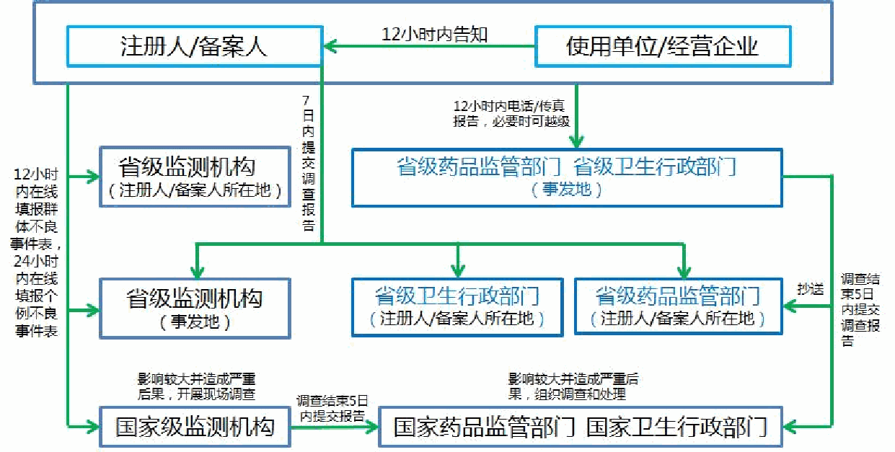

# 医疗器械注册人开展不良事件监测工作指南

附件

医疗器械注册人开展不良事件

监测工作指南

—— 1 ——

<!-- 第 1 页 -->

目 录

1.前言..................................................................................................................................................3

2.适用范围..........................................................................................................................................3

3.总体要求..........................................................................................................................................4

4.管理制度..........................................................................................................................................4

4.1 医疗器械不良事件监测工作领导小组..............................................................................4

4.2 医疗器械不良事件监测工作部门和人员..........................................................................5

4.3 医疗器械不良事件监测工作培训管理..............................................................................5

4.4 医疗器械不良事件调查......................................................................................................6

4.5 医疗器械不良事件应急处置..............................................................................................6

4.6 医疗器械不良事件监测记录管理......................................................................................6

5.工作程序..........................................................................................................................................7

5.1 个例医疗器械不良事件......................................................................................................7

5.2 群体医疗器械不良事件......................................................................................................9

5.3 定期风险评价报告..............................................................................................................9

5.4 重点监测工作.................................................................................................................... 10

5.5 风险控制.............................................................................................................................11

6.相关说明........................................................................................................................................12

6.1 定义和缩略词.................................................................................................................... 12

6.2 医疗器械不良事件报告流程图........................................................................................13

附件 1.《注册人医疗器械不良事件报告表》填报说明..............................................................12

附件 2.《群体医疗器械不良事件报告表》填报说明..................................................................31

—— 2 ——

<!-- 第 2 页 -->

1.前言

为指导医疗器械注册人、备案人（以下简称注册人）建立健

全医疗器械不良事件监测体系，推进医疗器械不良事件监测工作，

及时、有效控制医疗器械上市后风险，依据《医疗器械不良事件

监测和再评价管理办法》（国家市场监督管理总局 中华人民共和

国国家卫生健康委员会令 第 1 号）（以下简称《办法》）制定本

指南。本指南所称医疗器械注册人与《办法》中所称医疗器械上

市许可持有人内涵相同。

指南的目的是为注册人提供关于如何遵守法规和规章制度

方面的帮助，同时为医疗器械监管相关人员提供参考，说明如何

以公平、一致且有效的方式实现药品监督管理部门的要求和目标。

指南不具备法律效力，故对于本文中所述原则和实践的替代

办法，只要存在充分的理由就可以接受，但应当事先与有关方面

（人士）讨论这些替代办法，以避免出现不满足适用法律或者法

规要求的情况。

作为上述要求的必然结果，药品监督管理部门保留要求提供

资料或者材料的权利，或者规定本文中未予以具体说明的条件，

以便药品监督管理部门能够充分评估产品的安全有效和质量可

控情况。药品监督管理部门承诺确保这些要求的合理性，并对决

策进行明确记录。

2.适用范围

本指南适用于在中华人民共和国境内开展医疗器械不良事

件监测工作的注册人，为其开展医疗器械不良事件监测工作提供

指导，同时也可作为医疗器械监管相关部门开展医疗器械不良事

件监督、检查等工作的参考文件。

—— 3 ——

<!-- 第 3 页 -->

3.总体要求

注册人承担医疗器械不良事件监测主体责任，应当建立医疗

器械不良事件监测工作制度，配备数量与其规模相适应的人员从

事医疗器械不良事件监测工作，主动收集、上报、调查、分析、

评价医疗器械不良事件，及时采取有效措施控制风险并发布风险

信息，对上市医疗器械的安全性进行持续研究，按要求开展风险

评价及重点监测工作并提交相关报告，积极配合药品监督管理部

门和监测机构开展的医疗器械不良事件监测相关工作。境外注册

人还应当与指定代理人建立信息传递机制，及时互通医疗器械不

良事件监测和再评价信息。

注册人应当注册为国家医疗器械不良事件监测信息系统（以

下简称“系统”）用户，通过系统报告医疗器械不良事件相关信息，

并及时维护用户和产品注册信息。注册信息发生变化的应当立即

在系统中进行更新。

4.管理制度

注册人应当建立医疗器械不良事件监测工作制度，包括但不

限于以下方面。

## 4.1 医疗器械不良事件监测工作领导小组

### 4.1.1 成立由企业负责人为组长，研发、生产、销售、售后

和不良事件监测等部门人员组成的监测领导小组，全面领导、组

织、管理医疗器械不良事件监测工作。

### 4.1.2 审核批准企业建立的医疗器械不良事件监测工作制度、

工作程序、应急预案等。

### 4.1.3 定期召开领导小组工作会，共同商讨医疗器械不良事

件监测工作遇到的重大事件或者问题，安排部署后续工作。

—— 4 ——

<!-- 第 4 页 -->

### 4.1.4 组织开展医疗器械不良事件监测工作有关法律法规、

企业规章和相关知识的培训。

### 4.1.5 定期开展医疗器械不良事件监测工作监督检查及考核。

## 4.2 医疗器械不良事件监测工作部门和人员

### 4.2.1 设立或者指定相关部门负责医疗器械不良事件监测工

作，并配备与产品规模相适应数量的专（或者兼）职监测人员。

监测人员应当经过医疗器械不良事件监测专业培训，熟悉医疗器

械不良事件监测相关法规，具有医疗器械相关专业知识，熟悉所

持有医疗器械产品特点，具有较好的沟通和协调能力。

### 4.2.2 组织撰写企业医疗器械不良事件监测工作制度、工作

程序、应急预案等文件。

### 4.2.3 负责维护系统中用户及产品注册信息。

### 4.2.4 负责收集医疗器械不良事件报告，经调查核实后及时

上报至系统。

### 4.2.5 配合药品监管部门、监测机构、卫生主管部门等对医

疗器械不良事件开展的调查。

### 4.2.6 拟定企业医疗器械不良事件监测工作和培训年度计划，

并报领导小组审批。

### 4.2.7 负责管理医疗器械不良事件监测记录。

## 4.3 医疗器械不良事件监测工作培训管理

### 4.3.1 医疗器械不良事件监测工作培训应当纳入企业年度培

训计划，由领导小组负责审核并组织实施。

### 4.3.2 医疗器械不良事件监测工作培训对象应当覆盖企业全

体人员。

### 4.3.3 医疗器械不良事件监测工作培训内容应当包含现行相

—— 5 ——

<!-- 第 5 页 -->

关法律法规，企业制定的监测工作制度、工作程序，医疗器械不

良事件监测相关知识、分析评价方法、合理用械知识等。

### 4.3.4 培训结束应当进行效果评估，通过调查问卷、书面考

试等方式评价培训效果。

### 4.3.5 应当建立培训档案，包括培训计划、培训通知、培训

教材、人员签到表、考核表、培训效果评估表等资料。

## 4.4 医疗器械不良事件调查

### 4.4.1 导致死亡、严重伤害或者可能导致严重伤害或者死亡

的事件应当开展调查。

### 4.4.2 调查应当在充分准备的基础上开展，避免不必要的重

复调查。

### 4.4.3 调查的主要内容主要包括产品质量状况、伤害和产品

的关联性、使用环节操作和流通过程的合规性等。

### 4.4.4 调查结束后通过系统提交调查结果。

## 4.5 医疗器械不良事件应急处置

### 4.5.1 发生需要紧急处置的医疗器械不良事件时，注册人应

当及时采取必要风险措施控制，如停用、停止销售、召回等。

### 4.5.2 及时将相关情况报告所在区域省级药品监管部门和监

测机构。

### 4.5.3 及时通过系统报告相关个例医疗器械不良事件报告。

### 4.5.4 认真组织企业有关部门开展自查，密切跟踪事件进展，

必要时召开专家讨论会。

### 4.5.5 积极配合药品监管部门、监测机构、卫生主管部门对

医疗器械不良事件开展的调查。

## 4.6 医疗器械不良事件监测记录管理

—— 6 ——

<!-- 第 6 页 -->

### 4.6.1 应当指定人员负责管理医疗器械不良事件监测记录。

### 4.6.2 应当确保医疗器械不良事件相关信息被完整准确记录，

主要包括《注册人医疗器械不良事件报告表》原始报告表，医疗

器械不良事件发现、收集、调查、报告和控制过程中的有关资料

和相关记录等。

### 4.6.3 监测记录应当保存至医疗器械有效期后 2 年，无有效

期的保存期限不得少于 5 年。植入性医疗器械的监测记录应当永

久保存。

### 4.6.4 监测记录应当进行适当备份，避免意外丢失或者损毁。

### 4.6.5 应当制定严格的工作交接程序，确保管理人员变动时

监测记录完整交接。

5.工作程序

## 5.1 个例医疗器械不良事件

医疗器械不良事件报告应当遵循可疑即报的原则。报告内容

应当真实、完整、准确，导致死亡、严重伤害或者可能导致严重

伤害或者死亡的医疗器械不良事件应当报告；创新医疗器械在首

个注册周期内，应当报告所有医疗器械不良事件（报告表填报说

明见附件 1）。

### 5.1.1 个例医疗器械不良事件收集

注册人可根据产品特点建立有效的医疗器械不良事件信息

收集渠道，可通过企业网站、用户随访、用户投诉、文献报道、

手机 APP、国内外监管部门网站等途径主动收集本企业产品不良

事件。

### 5.1.2 个例医疗器械不良事件报告

—— 7 ——

<!-- 第 7 页 -->

注册人发现或者获知可疑医疗器械不良事件的，应当立即调

查原因，导致死亡的应当在 7 日内报告；导致严重伤害、可能导

致严重伤害或者死亡的应当在 20 日内报告。产品在境外发生导

致或者可能导致严重伤害或者死亡医疗器械不良事件，境外注册

人指定的代理人和国产医疗器械注册人应当自发现或者获知之

日起 30 日内报告。

### 5.1.3 个例医疗器械不良事件调查

医疗器械不良事件调查主要是了解医疗器械不良事件发生

情况（包括不良事件发生时间、伤害/故障表现、不良事件后果

等）、医疗器械使用情况（包括维护和保养情况、产品使用期限、

合并用药/械情况、使用人员资质、具体操作过程等）、患者诊治

情况（包括原患疾病、相关体征及各种检查数据、救治措施、转

归情况等）、既往类似不良事件、产品生产过程、产品贮存流通

情况以及同型号同批号产品追踪等，必要时与医护人员或者器械

使用人员沟通。

### 5.1.4 个例医疗器械不良事件分析评价

注册人报告或者通过系统获知医疗器械不良事件后，应当按

要求开展分析和评价工作，导致死亡的事件应当在 30 日内，导

致严重伤害、可能导致严重伤害或者死亡的事件应当在 45 日内

向注册人所在地省级监测机构报告评价结果。对于事件情况和评

价结果有新的发现或者认知的，应当补充报告。

通过对个例事件的评价，认为产品可能存在风险的，应当对

产品进行风险评价，在不良事件调查核实的基础上，深入分析监

测数据、产品检验情况和其他风险信息等资料，必要时召开专家

讨论会，在计划时限内通过系统提交评价报告，并根据评价结果

—— 8 ——

<!-- 第 8 页 -->

采取必要的风险控制措施。

## 5.2 群体医疗器械不良事件

### 5.2.1 注册人发现或者获知群体医疗器械不良事件后应当立

即暂停生产、销售，通知使用单位停止使用相关器械。

### 5.2.2 注册人应当在 12 小时内通过电话或者传真等方式报告

不良事件发生地省（自治区、直辖市）药品监督管理部门和卫生

主管部门，必要时可以越级报告，并通过系统报告群体医疗器械

不良事件基本信息（报告表填报说明见附件 2），对每一事件还

应当在 24 小时内按个例事件报告。

### 5.2.3 注册人迅速开展调查和生产质量管理体系自查，7 日内

向企业所在地与不良事件发生地省（自治区、直辖市）药品监督

管理部门和监测机构报告。

### 5.2.4 注册人应当积极配合药品监管部门和卫生主管部门开

展的调查。

### 5.2.5 注册人应当深入分析事件发生原因，及时发布风险警

示信息，将自查情况和所采取的措施报所在地及不良事件发生地

省（自治区、直辖市）药品监督管理部门，必要时召回相关医疗

器械。

## 5.3 定期风险评价报告

### 5.3.1 首次获得批准注册或者备案的医疗器械，注册人应当

在每满 1 年后的 60 日内完成上年度产品定期风险评价报告。其

中，经国家药品监督管理局注册的，应当提交至国家监测机构；

经省、自治区、直辖市药品监督管理部门注册的，应当提交至所

在地省级监测机构。第一类医疗器械的定期风险评价报告由备案

人留存备查。

—— 9 ——

<!-- 第 9 页 -->

### 5.3.2 获得延续注册的医疗器械，注册人应当在下一次延续

注册申请时完成本注册周期的定期风险评价报告，并由注册人留

存备查。

### 5.3.3 定期风险评价报告应当对产品基本信息、国内外上市

情况、既往采取的风险控制措施、监测数据和其他风险信息等资

料进行汇总分析，评价该产品的风险与受益。

### 5.3.4 定期风险评价报告中医疗器械的风险信息汇总在其生

命周期内应当是连续、不间断的。

## 5.4 重点监测工作

### 5.4.1 注册人应当根据省级以上药品监督管理部门的要求制

定产品重点监测实施方案（应当包括组织方式、时间安排、工作

程序等内容），并报送承担该重点监测品种的药品监督管理部门

审核备案。

### 5.4.2 注册人应当根据情况可将其产品用户均列为开展重点

监测的哨点，记录产品使用情况，采取定期走访、专人收集、建

立收集平台等方式主动收集不良事件等风险信息。

### 5.4.3 注册人应当及时对监测哨点收集到的死亡、严重伤害

或者可能导致严重伤害或者死亡的不良事件进行调查。

### 5.4.4 注册人应当对监测哨点收集的不良事件进行汇总，结

合系统反馈数据和文献资料进行风险分析，评估不良事件风险特

征、严重程度、不良事件发生率等风险状况。

### 5.4.5 注册人应当从重点监测品种的结构设计、原材料成分、

生产工艺、技术标准、使用方法及环境、存贮运输等方面，明确

风险事件中故障或者伤害发生根源，评价产品风险。同时根据产

品风险情况组织内部或者相关行业专家召开会议，进一步明确其

—— 10 ——

<!-- 第 10 页 -->

产品风险。

### 5.4.6 注册人应当通过重点监测，针对产品存在的具体问题

和风险情况，采取相应的风险控措施，包括：停止生产、经营、

使用，修改产品设计，改变生产工艺，警示、检查、修理、重新

标签、修改并完善说明书、软件更新、替换、收回、销毁等方式,

并报告承担重点监测及所在地的药品监督管理部门，需要变更注

册或者重新注册的按有关要求办理。

### 5.4.7 注册人应当定期向承担重点监测的药品监督管理部门

汇报工作进展。对跨年度的重点监测，每年应当对重点监测工作

进展情况进行总结，撰写年度总结报告；重点监测工作结束后对

重点监测产品特点、监测数据、文献资料研究、专家讨论会情况

等资料进行汇总分析，撰写产品风险评价报告，报送负责重点监

测品种的药品监督管理部门。

### 5.4.8 创新医疗器械产品自动纳入重点监测。创新医疗器械

注册人应当在首个注册周期内，每半年向国家监测机构提交产品

不良事件监测分析评价报告。

## 5.5 风险控制

### 5.5.1 注册人通过医疗器械不良事件监测，发现存在可能危

及人体健康和生命安全的不合理风险的医疗器械，应当根据风险

情况采取适当的控制措施。

### 5.5.2 注册人可采取的风险控制措施主要包括停止产品生产、

销售并通知相关单位暂停使用；实施产品召回；发布风险警示信

息；对生产质量体系进行自查和整改；修改说明书、标签和操作

—— 11 ——

<!-- 第 11 页 -->

手册等；改进工艺、设计、产品技术要求以及其他需要采取的措

施。

### 5.5.3 注册人在必要时应当对医疗器械开展再评价（如对医

疗器械的安全、有效有认识上发生改变，医疗器械不良事件监测、

评估结果表明医疗器械可能存在缺陷，或者省级以上药品监督管

理部门要求开展再评价时），并根据再评价结果采取适当风险控

制措施。

### 5.5.4 如再评价结果表明已注册或者备案的医疗器械存在危

及人身安全的缺陷，且无法通过技术改进、修改说明书和标签等

措施消除或者控制风险，或者风险获益比不可接受的，注册人应

当主动申请注销医疗器械注册证或者取消产品备案。

### 5.5.5 对于医疗器械在境外因不良事件被采取控制措施的

情况，注册人（境外注册人指定的代理人或者国产医疗器械注

册人）应当在获知后 24 小时内，将境外不良事件情况、控制

措施情况和在境内拟采取的控制措施报国家药品监督管理局

和国家中心，抄送所在地省级药品监督管理部门，及时报告后

续处置情况。

### 5.5.6 注册人应当及时向企业所在地省级药品监督管理部门

报告与用械安全相关的风险及处置情况，并向社会公布。

6.相关说明

## 6.1 定义和缩略词

### 6.1.1 医疗器械注册人和备案人即是《办法》中所称医疗器

械上市许可持有人，是指医疗器械注册证书和医疗器械备案凭证

—— 12 ——

<!-- 第 12 页 -->

的注册人、备案人。

### 6.1.2 医疗器械不良事件，是指已上市的医疗器械，在正常

使用情况下发生的，导致或者可能导致人体伤害的各种有害事件。

### 6.1.3 严重伤害，是指有下列情况之一者：

（1）危及生命；

（2）导致机体功能的永久性伤害或者机体结构的永久性损

伤；

（3）必须采取医疗措施才能避免上述永久性伤害或者损伤。

### 6.1.4 群体医疗器械不良事件，是指同一医疗器械在使用过

程中，在相对集中的时间、区域内发生，对一定数量人群的身体

健康或者生命安全造成损害或者威胁的事件。

### 6.1.5 医疗器械不良事件监测，是指对医疗器械不良事件的

收集、报告、调查、分析、评价和控制的过程。

### 6.1.6 医疗器械重点监测，是指为研究某一品种或者产品上

市后风险情况、特征、严重程度、发生率等，主动开展的阶段性

监测活动。

### 6.1.7 医疗器械再评价，是指对已注册或者备案、上市销售

的医疗器械的安全性、有效性进行重新评价，并采取相应措施的

过程。

## 6.2 医疗器械不良事件报告流程图

### 6.2.1 个例医疗器械不良事件报告流程图

—— 13 ——

<!-- 第 13 页 -->

### 6.2.2 群体医疗器械不良事件报告流程图

附件：1.《注册人医疗器械不良事件报告表》填报说明

2.《群体医疗器械不良事件报告表》填报说明

—— 14 ——

 <!-- desc: 这是一张不良事件报告审核流程图。左侧展示了从“注册人/经营企业”经市、省各级监测机构至“国家监测机构”的层级流转路径；右侧对应“上报、市级审核、报告评价、省级审核、复核”五个关键步骤，并标注了具体的时限要求（如7日/20日报送、10日审核等）。图中包含双向箭头表示反馈或退回机制，最终指向“报告审核结束”。 -->

 <!-- desc: 该图为药品不良事件报告与处置流程图。涉及注册人/备案人、使用单位、各级监测机构及监管部门。流程规定：企业需在12小时内告知注册人，并向省级监测机构或监管部门报告（含电话、传真及在线填报）。针对严重影响事件，需开展现场调查并上报国家级机构。最终要求相关部门在调查结束后5日内提交调查报告。 -->

<!-- 第 14 页 -->

附件 1

《注册人医疗器械不良事件

报告表》填报说明

1. 注册人医疗器械不良事件报告表

—— 15 ——

**表格（第 15 页）**

<table border="1">
    <tr>
        <td colspan="2" style="text-align:center; font-size: 20px; background-color:#f2f2f2;">注册人医疗器械不良事件报告表</td>
    </tr>
    <tr>
        <td colspan="2" style="background-color:#d3d3d3;"><b>报告基本情况</b></td>
    </tr>
    <tr>
        <td>报告编码：</td>
        <td></td>
    </tr>
    <tr>
        <td>报告日期：</td>
        <td></td>
    </tr>
    <tr>
        <td>报告人：</td>
        <td></td>
    </tr>
    <tr>
        <td>单位名称：</td>
        <td></td>
    </tr>
    <tr>
        <td>联系地址：</td>
        <td></td>
    </tr>
    <tr>
        <td>联系人：</td>
        <td></td>
    </tr>
    <tr>
        <td>联系电话：</td>
        <td></td>
    </tr>
    <tr>
        <td>发生地：</td>
        <td></td>
    </tr>
    <tr>
        <td colspan="2" style="background-color:#d3d3d3;"><b>医疗器械情况</b></td>
    </tr>
    <tr>
        <td>产品名称*：</td>
        <td></td>
    </tr>
    <tr>
        <td>注册证编号*：</td>
        <td></td>
    </tr>
    <tr>
        <td>曾用注册证编号：</td>
        <td></td>
    </tr>
    <tr>
        <td>曾用注册证编号上报：</td>
        <td></td>
    </tr>
    <tr>
        <td>型号：</td>
        <td></td>
    </tr>
    <tr>
        <td>规格：</td>
        <td></td>
    </tr>
    <tr>
        <td>产地*：</td>
        <td></td>
    </tr>
    <tr>
        <td>管理类别*：</td>
        <td></td>
    </tr>
    <tr>
        <td>产品类别*：</td>
        <td></td>
    </tr>
    <tr>
        <td>产品批号：</td>
        <td></td>
    </tr>
    <tr>
        <td>产品编号：</td>
        <td></td>
    </tr>
    <tr>
        <td>UDI：</td>
        <td></td>
    </tr>
    <tr>
        <td>生产日期：</td>
        <td></td>
    </tr>
    <tr>
        <td>有效期至：</td>
        <td></td>
    </tr>
    <tr>
        <td colspan="2" style="background-color:#d3d3d3;"><b>不良事件情况</b></td>
    </tr>
    <tr>
        <td>事件发生日期*：</td>
        <td></td>
    </tr>
    <tr>
        <td>事件发现或者获知日期*：</td>
        <td></td>
    </tr>
    <tr>
        <td>伤害*：</td>
        <td></td>
    </tr>
    <tr>
        <td>伤害表现：</td>
        <td rowspan="2"></td>
    </tr>
    <tr>
        <td>伤害表现附件：</td>
    </tr>
    <tr>
        <td>器械故障表现：</td>
        <td rowspan="2"></td>
    </tr>
    <tr>
        <td>器械故障表现附件：</td>
    </tr>
    <tr>
        <td>姓名：</td>
        <td>出生日期：</td>
    </tr>
    <tr>
        <td>年龄类型：</td>
        <td>年龄：</td>
    </tr>
    <tr>
        <td>性别：</td>
        <td>病历号：</td>
    </tr>
    <tr>
        <td colspan="2">既往病史：</td>
    </tr>
    <tr>
        <td colspan="2" style="background-color:#d3d3d3;"><b>使用情况</b></td>
    </tr>
    <tr>
        <td>预期治疗疾病或者作用：</td>
        <td></td>
    </tr>
</table>

<!-- 第 15 页 -->

注：表中标注*为必填项

—— 16 ——

**表格（第 16 页）**

<table border="1">
    <tr>
        <td colspan="2">器械使用日期*：</td>
    </tr>
    <tr>
        <td>使用场所*：</td>
        <td>场所名称：</td>
    </tr>
    <tr>
        <td colspan="2">使用过程*：</td>
    </tr>
    <tr>
        <td colspan="2">合并用药/械情况说明：</td>
    </tr>
    <tr>
        <td colspan="2" style="background-color:#f2f2f2;"><b>事件调查</b></td>
    </tr>
    <tr>
        <td colspan="2">是否开展了调查*：</td>
    </tr>
    <tr>
        <td colspan="2">调查情况： 调查情况附件：</td>
    </tr>
    <tr>
        <td colspan="2" style="background-color:#f2f2f2;"><b>评价结果</b></td>
    </tr>
    <tr>
        <td colspan="2">关联性评价*：</td>
    </tr>
    <tr>
        <td colspan="2">事件原因分析： 事件原因分析附件：</td>
    </tr>
    <tr>
        <td colspan="2">是否需要开展产品风险评价*：</td>
    </tr>
    <tr>
        <td colspan="2">计划提交时间：</td>
    </tr>
    <tr>
        <td colspan="2" style="background-color:#f2f2f2;"><b>控制措施</b></td>
    </tr>
    <tr>
        <td colspan="2">是否已采取控制措施*：</td>
    </tr>
    <tr>
        <td colspan="2">具体控制措施： 具体控制措施附件：</td>
    </tr>
    <tr>
        <td colspan="2">未采取控制措施原因：</td>
    </tr>
    <tr>
        <td colspan="2" style="background-color:#f2f2f2;"><b>错报误报</b></td>
    </tr>
    <tr>
        <td colspan="2">是否错报误报*：</td>
    </tr>
    <tr>
        <td colspan="2">错报误报原因： 错报误报原因附件：</td>
    </tr>
    <tr>
        <td colspan="2" style="background-color:#f2f2f2;"><b>报告合并</b></td>
    </tr>
    <tr>
        <td colspan="2">是否合并报告*：</td>
    </tr>
    <tr>
        <td colspan="2">合并报告编码：</td>
    </tr>
    <tr>
        <td colspan="2" style="background-color:#f2f2f2;"><b>报告审核情况（上报地设区的市级中心）</b></td>
    </tr>
    <tr>
        <td colspan="2">审核结果*：</td>
    </tr>
    <tr>
        <td colspan="2">审核意见：</td>
    </tr>
    <tr>
        <td colspan="2">审核人：</td>
    </tr>
    <tr>
        <td colspan="2">审核单位：</td>
    </tr>
    <tr>
        <td colspan="2">审核日期：</td>
    </tr>
    <tr>
        <td colspan="2" style="background-color:#f2f2f2;"><b>评价审核情况（注册人所在地省级监测机构）</b></td>
    </tr>
    <tr>
        <td colspan="2">审核结果*：</td>
    </tr>
    <tr>
        <td colspan="2">审核意见：</td>
    </tr>
    <tr>
        <td colspan="2">审核人：</td>
    </tr>
    <tr>
        <td colspan="2">审核单位：</td>
    </tr>
    <tr>
        <td colspan="2">审核日期：</td>
    </tr>
    <tr>
        <td colspan="2" style="background-color:#f2f2f2;"><b>事发地省级意见</b></td>
    </tr>
    <tr>
        <td colspan="2">意见：</td>
    </tr>
    <tr>
        <td colspan="2">填写人：</td>
    </tr>
    <tr>
        <td colspan="2">填写时间：</td>
    </tr>
    <tr>
        <td colspan="2" style="background-color:#f2f2f2;"><b>评价复核情况（国家监测机构）</b></td>
    </tr>
    <tr>
        <td colspan="2">复核结果*：</td>
    </tr>
    <tr>
        <td colspan="2">复核意见：</td>
    </tr>
</table>

<!-- 第 16 页 -->

2.填写要求

《注册人医疗器械不良事件报告表》由报告基本情况、医疗

器械情况、不良事件情况、使用情况、事件调查、评价结果、控

制措施、错报误报、报告合并、报告审核情况、评价审核情况、

事发地省级意见、评价复核情况等 13 部分组成，内容填写应当

真实、准确、完整。

## 2.1 报告基本情况

### 2.1.1 报告编码：指用于不良事件报告检索查询的编码，具

有唯一性，由系统自动生成。

### 2.1.2 报告日期：指填报医疗器械不良事件的确切时间，由

系统自动生成。

### 2.1.3 报告人：指填报医疗器械不良事件的人员姓名，由系

统根据登录账号自动生成。

### 2.1.4 单位名称：指上报医疗器械不良事件单位的全称，由

系统根据登录账号自动生成。

### 2.1.5 联系地址：指上报医疗器械不良事件单位的联系地址，

由系统根据登录账号自动生成。

### 2.1.6 联系人：指上报医疗器械不良事件单位负责不良事件

监测的人员，由系统根据登录账号自动生成。

### 2.1.7 联系电话：上报医疗器械不良事件单位负责不良事件

监测部门电话，由系统根据登录账号自动生成。

### 2.1.8 发生地：由系统根据登录账号自动生成（境内报告）。

—— 17 ——

<!-- 第 17 页 -->

## 2.2 医疗器械情况

### 2.2.1 产品名称：指医疗器械不良事件涉及产品的名称，必

填项，通过【选择】对话框填写，应当确保产品名称与注册证书、

说明书、标签和包装标识保持一致。

### 2.2.2 注册证编号：指医疗器械不良事件涉及产品注册证书

上的注册号。必填项，选择产品名称后由系统自动填写，或者通

过【选择】对话框填写。

### 2.2.3 曾用注册证编号：指医疗器械不良事件涉及产品发生

过注册证编号变更，产品发生此事件前曾经使用过的注册证编号。

如有，请根据有关资料准确填写。

### 2.2.4 曾用注册证编号上报：若本次填报医疗器械不良事件

使用的注册证编号是曾用注册证编号，选择“是”；反之，选择“否”。

### 2.2.5 型号：按照产品说明书、标签或者包装标识准确填写。

### 2.2.6 规格：按照产品说明书、标签或者包装标识准确填写。

### 2.2.7 产地：必填项，选择产品名称后由系统自动填写。

### 2.2.8 管理类别：必填项，选择产品名称后由系统自动填写。

### 2.2.9 产品类别：必填项，选择产品名称后由系统自动填写。

### 2.2.10 产品批号：按批号管理的医疗器械产品必须填写，应

当与产品标签或者包装标识一致。

### 2.2.11 产品编号：按序列号管理的医疗器械产品必须填写，

应当与产品标签或者包装标识一致。

### 2.2.12 UDI：医疗器械产品唯一标识，指在医疗器械产品或

—— 18 ——

<!-- 第 18 页 -->

者包装上附载的，由数字、字母或者符号组成的代码，用于对医

疗器械进行唯一性识别。参与唯一标识试点企业填写。

### 2.2.13 生产日期：指医疗器械在生产线上完成所有工序，经

过检验并包装成为可在市场上销售的成品的时间。通过对话框选

择填写，应当与产品标签或者包装标识一致。

### 2.2.14 有效期至：指医疗器械在规定的条件下能够保证质量

的期限。通过对话框选择填写，应当与产品标签或者包装标识一

致。

## 2.3 不良事件情况

### 2.3.1 事件发生日期：指医疗器械不良事件实际发生日期。

必填项，通过对话框选择填写。 如仅知道事件发生年份，填写

当年的 1 月 1 日；如仅知道年份和月份，填写当月的第 1 日；如

年月日均未知，填写事件获知日期，并在“2.4.5 使用过程”给予说

明。

### 2.3.2 事件发现或者获知日期：指报告单位发现或者获知医

疗器械不良事件的确切时间。必填项，通过对话框选择填写。

### 2.3.3 伤害：指医疗器械（可能）引发的不良事件的伤害程

度。必填项，根据具体情况选择“死亡”“严重伤害”或者“其他”。

其中“严重伤害”判定标准参考指南正文“6.1.3 严重伤害”，“其

他”主要指不符合“严重伤害”标准的伤害事件或者器械故障。

如与后期调查情况不符，注册人可在调查情况或者补充资料中

予以说明。

—— 19 ——

<!-- 第 19 页 -->

### 2.3.4 伤害表现：指不良事件发生后对患者造成的具体伤害，

例如心脏骤停、二次手术等。选择“严重伤害”时，“伤害表现”为

必填项。信息系统已嵌入部分产品“伤害术语”， 请优先从系统

选择，点击【选择】按钮弹出的对话框中只显示此医疗器械分类

目录下的伤害术语，点击【全部选择】按钮弹出的对话框中显示

全部分类目录下的伤害术语。若系统中无适宜术语，请用简洁语

言描述伤害表现。

### 2.3.5 伤害表现附件：若有伤害表现佐证材料可作为附件上

传。

### 2.3.6 器械故障表现：指医疗器械使用时发生的可能或者已

经对患者造成伤害的故障；或者使用前发现，再次发生可能对患

者造成死亡或者伤害的故障。信息系统已嵌入部分产品“故障术

语”，请优先从系统选择，点击【选择】按钮弹出的对话框中只

显示此医疗器械分类目录下的故障术语，点击【全部选择】按钮

弹出的对话框中显示全部分类目录下的故障术语。如系统中无适

宜术语，请用简洁语言描述故障表现。

### 2.3.7 器械故障表现附件：若有故障表现佐证材料可作为附

件上传。

### 2.3.8 姓名：指医疗器械不良事件涉及患者的姓名，新生儿

无姓名，可填写××子或者××女。若无法获知填写“不详”。

### 2.3.9 出生日期：通过对话框选择填写。

### 2.3.10 年龄类型：通过对话框选择填写。3 岁以上人群建议

—— 20 ——

<!-- 第 20 页 -->

选择“岁”，1 至 3 岁（含）幼儿根据实际情况选择“岁”或者“月”，

1（含）至 12 个月婴儿建议选择“月”，新生儿（0-1 个月）建议

选择“日”。

### 2.3.11 年龄：根据获知情况填写。

### 2.3.12 性别：根据获知情况选择相应选项。

### 2.3.13 病历号：根据病例或者调查获知情况填写。

### 2.3.14 既往病史：根据患者病历或者调查获知情况填写。

## 2.4 使用情况

### 2.4.1 预期治疗疾病或者作用：指医疗器械不良事件涉及产

品的用途或者适用范围，参照产品注册证的预期用途填写。例如

血管内支架预期治疗疾病或者作用为“用于治疗急性心肌梗死”。

### 2.4.2 器械使用日期：指医疗器械不良事件涉及产品的具体

使用时间。必填项，通过对话框选择填写。如仅知道事件使用年

份，填写当年的 1 月 1 日；如仅知道年份和月份，填写当月的第

1 日；如年月日均未知，填写事件获知日期，并在“2.4.5 使用过

程”给予说明。

### 2.4.3 使用场所：指医疗器械不良事件涉及产品的实际使用

地点类型。必填项，填写时请选择相应的选项。

### 2.4.4 场所名称：若“2.4.3 使用场所”选择“其他”，场所名称

为必填项。

### 2.4.5 使用过程：必填项，对于有源和无源医疗器械应当描

述产品具体操作使用情况，出现的非预期结果，（可能）对患者

—— 21 ——

<!-- 第 21 页 -->

造成的伤害，采取的救治措施及结果等。对于体外诊断医疗器械，

应当描述患者诊疗信息（如疾病情况、用药情况等）、样品检测

过程与结果、发现的异常情况、采取的措施、最终结果判定、对

临床诊疗的影响等。

### 2.4.6 合并用药/械情况说明：指发生医疗器械不良事件期间，

与怀疑器械同时使用的药品或者其他医疗器械，而且报告人认为

合并用药/械与不良事件的发生无直接相关性。

## 2.5 事件调查

### 2.5.1 是否开展了调查：必填项，如果开展了调查，选择“是”；

反之，选择“否”。

### 2.5.2 调查情况：若“2.5.1 是否开展了调查”选择“是”，本项

为必填项。调查应当重点了解患者情况、产品质量状况、操作使

用/维护情况、伤害/故障情况、已采取措施等。

### 2.5.3 调查情况附件：若调查内容较多，可将调查报告作为

附件上传。

## 2.6 评价结果

### 2.6.1 关联性评价：指分析评价不良事件与涉及医疗器械之

间的相关性。必填项，判断参考依据：

——与产品有关：（1）两者存在合理时间关系；（2）属于产

品已知风险或者可以用产品的机理去解释；（3）停止使用后伤害

减轻或者消失；（4）再次使用后伤害再次出现；（5）无法用其他

影响因素解释。满足上述两条即可。若无法排除产品因素建议选

—— 22 ——

<!-- 第 22 页 -->

择“与产品有关”。

——与产品无关：（1）两者不存在合理时间关系；（2）该不

良事件为该产品不可能导致的事件类型；（3）该不良事件可用合

并用械/药、患者病情进展、其他治疗影响来解释。满足上述一

条即可。

——无法确定：（1）两者时间关系不明确；（2）报告内容描

述不清、其他影响因素不明确、资料无法补充等。满足上述一条

即可。

### 2.6.2 事件原因分析：必填项，注册人应当广泛收集不良事

件信息，综合分析患者情况、产品设计及性能、操作使用及其他

因素。如不良事件重要信息无法获得（如上报人员不配合、无法

联系等），原因无法确定，应当说明情况。

### 2.6.3 事件原因分析附件：若不良事件原因分析内容较多，

可将详细内容作为附件上传。

### 2.6.4 是否需要开展产品风险评价：必填项，如产品可能存

在需关注风险（如不良事件发生趋势明显改变、不良事件出现新

模式等情况）或者监管部门提出要求的，选择“是”。如风险暂时

不需要处理且监管部门未提出要求，选择“否”。

### 2.6.5 计划提交时间：若“2.6.4 是否需要开展产品风险评价”选择

“是”，本项为必填项，通过对话框选择填写，建议选择时间范围在 3

个月之内，如有特殊情况可与所在地省级监测机构沟通。

## 2.7 控制措施

—— 23 ——

<!-- 第 23 页 -->

### 2.7.1 是否已采取控制措施：若已采取控制措施，选择“是”；

反之，选择“否”。

### 2.7.2 具体控制措施：指对涉事产品采取的风险控制措施，

“2.7.1 是否已采取控制措施” 选择“是”，本项为必填项。控制措

施主要包括暂停生产/销售/使用，召回，发布警示信息，QMS 自

查，修改说明书/标签/操作手册，改进工艺/设计，开展再评价等。

### 2.7.3 具体控制措施附件：若有比较详细的控制措施，可将

相关材料作为附件上传。

### 2.7.4 未采取控制措施原因：若“2.7.1 是否已采取控制措施”

选择“否”，本项为必填项。可能的原因主要包括不良事件与产品

无关，或者当前风险可控，无需进一步措施。

## 2.8 错报误报

### 2.8.1 是否错报误报：错报误报指该不良事件实际不存在或

者报告涉及企业并无该产品。必填项，若存在错报误报情况，选

择“是”；反之，填“否”。

### 2.8.2 错报误报原因：若“2.8.1 是否错报误报”选择“是”，本

项为必填项。原因主要包括不良事件涉及产品非本企业产品或者

经调查无此不良事件。

### 2.8.3 错报误报原因附件：若“2.8.1 是否错报误报”选择“是”，

必须将佐证材料作为附件上传。

## 2.9 报告合并

### 2.9.1 是否合并报告：必填项，若确认此表格与系统中已通

过审核（复核）的报告为同一不良事件，选择“是”；反之，选择

—— 24 ——

<!-- 第 24 页 -->

“否”。

### 2.9.2 合并报告编码：若“2.9.1 是否合并报告”选择“是”，本

项为必填项。通过对话框选择填写。

## 2.10 报告审核情况（上报地市/区级中心填写）

### 2.10.1 审核结果：必填项，经核实本次医疗器械不良事件真

实且符合报告填写要求，选择“通过”；反之，选择“退回”。

### 2.10.2 审核意见：若“2.10.1 审核结果”选择“退回”，本项为

必填项，需说明退回理由。

### 2.10.3 审核人：由系统根据登录账号自动生成。

### 2.10.4 审核单位：由系统根据登录账号自动生成。

### 2.10.5 审核日期：系统自动生成。

## 2.11 评价审核情况（注册人所在地省级监测机构填写）

### 2.11.1 审核结果：主要审核注册人报告填写是否符合要求、

关联性评价是否准确、事件原因分析是否合理等方面，通过对话

框选择“通过”或者“退回”。

### 2.11.2 审核意见：若“2.11.1 审核结果”选择“退回”，本项为

必填项，需说明退回理由。

### 2.11.3 审核人：由系统根据登录账号自动生成。

### 2.11.4 审核单位：由系统根据登录账号自动生成。

### 2.11.5 审核日期：系统自动生成。

## 2.12 事发地省级意见（事发地省级监测机构填写）

### 2.12.1 意见：主要填写事件的处置情况（开展的调查、采取

的措施等）及相关建议。

—— 25 ——

<!-- 第 25 页 -->

### 2.12.2 填写人：由系统根据登录账号自动生成。

### 2.12.3 填写时间：系统自动生成。

## 2.13 评价复核情况（国家监测机构填写）

### 2.13.1 复核结果：复核注册人的报告填写是否符合要求、关

联性评价是否准确、事件原因分析是否合理等，评价省级监测机

构的审核是否客观准确，通过对话框选择“通过”或者“退回”。

### 2.13.2 复核意见：若“2.13.1 复核结果”选择“退回”，本项为

必填项，需说明退回理由。

3.注意事项

## 3.1 注册人应当在信息系统及时录入其单位信息，境外企业

应当填写其在中国境内代理人信息，并对上述信息及时维护。其

中企业名称发生变更，注册人应当联系所在地省级监测机构，通

过省级监测机构进行名称变更操作；其他信息变更，注册人通过

系统提交申请后由省级监测机构审核后生效。

## 3.2 注册人应当在信息系统及时维护其产品信息，产品新上

市时应当及时将其信息录入信息系统。产品信息发生变更时，注

册人应当及时在信息系统提交修改申请，由省级监测机构审核后

生效。

## 3.3 注册人填写“产品名称”和“注册证编号”只能通过【选择】

对话框查找填写。

## 3.4 表中“产品批号”和“产品编号”不能同时为空。

## 3.5 表中“伤害表现”和“器械故障表现”不能同时为空。

—— 26 ——

<!-- 第 26 页 -->

## 3.6 注册人在调查之前应当充分准备，了解涉及器械情况（设

计/生产、流通/储存）、不良事件情况（伤害、故障表现），明确

需进一步收集的信息，尽量避免重复调查，影响医疗机构正常工

作秩序。

## 3.7 医疗器械不良事件报告经分析评价可能存在不符合不良

事件定义的情况（如使用未获得注册证/备案凭证医疗器械导致

或者可能导致的伤害或者死亡事件，非正常使用医疗器械导致或

者可能导致的伤害或者死亡事件，超产品注册证批准适用范围使

用医疗器械，超出使用寿命或者有效期使用医疗器械等），但此

类情况不属于“错报误报”，注册人可在“未采取控制措施原因”予

以说明。

## 3.8 若报告前可确认事件不符合医疗器械不良事件定义，无

需按照医疗器械不良事件报告，但不免除其按照其他法规报告的

义务（如医疗器械临床试验过程中发生的不良事件应当按照医疗

器械临床试验相关规定报告，使用前发现医疗器械缺陷可以按照

产品质量投诉程序向注册人或者经营企业反馈）。

## 3.9 注册人发现“错报误报”情况后，应当在信息系统中说明

情况并及时将相关问题反馈所在地省级监测机构。

附件 2

—— 27 ——

<!-- 第 27 页 -->

《群体医疗器械不良事件报告表》填报说明

1. 群体医疗器械不良事件报告表

注： *为必填项。

—— 28 ——

**表格（第 28 页）**

<table border="1">
    <tr>
        <td align="center" bgcolor="#d3d3d3"><b>群体医疗器械不良事件报告表</b></td>
    </tr>
    <tr>
        <td bgcolor="#d3d3d3"><b>报告基本情况</b></td>
    </tr>
    <tr>
        <td>报告编码：</td>
    </tr>
    <tr>
        <td>报告日期：</td>
    </tr>
    <tr>
        <td>报告人：</td>
    </tr>
    <tr>
        <td>报告单位：</td>
    </tr>
    <tr>
        <td bgcolor="#d3d3d3"><b>事件基本情况</b></td>
    </tr>
    <tr>
        <td>使用单位*：</td>
    </tr>
    <tr>
        <td>用械人数*：</td>
    </tr>
    <tr>
        <td>事件发生人数*：</td>
    </tr>
    <tr>
        <td>发生地区*：</td>
    </tr>
    <tr>
        <td>首例用械时间*：</td>
    </tr>
    <tr>
        <td>首例发生时间*：</td>
    </tr>
    <tr>
        <td bgcolor="#d3d3d3"><b>医疗器械情况</b></td>
    </tr>
    <tr>
        <td>注册证编号*：</td>
    </tr>
    <tr>
        <td>产品名称*：</td>
    </tr>
    <tr>
        <td>产品批号：</td>
    </tr>
    <tr>
        <td>产品编号：</td>
    </tr>
    <tr>
        <td>注册人名称：</td>
    </tr>
    <tr>
        <td>型号：</td>
    </tr>
    <tr>
        <td>规格</td>
    </tr>
    <tr>
        <td bgcolor="#d3d3d3"><b>事件主要表现</b></td>
    </tr>
    <tr>
        <td>伤害表现：</td>
    </tr>
    <tr>
        <td>器械故障表现：</td>
    </tr>
    <tr>
        <td>事件发生过程*：</td>
    </tr>
    <tr>
        <td bgcolor="#d3d3d3"><b>审核情况（报告单位所在地省级监测机构填写）</b></td>
    </tr>
    <tr>
        <td>审核单位：</td>
    </tr>
    <tr>
        <td>审核人：</td>
    </tr>
    <tr>
        <td>审核日期：</td>
    </tr>
    <tr>
        <td>审核结果*：</td>
    </tr>
    <tr>
        <td>审核意见*：</td>
    </tr>
</table>

<!-- 第 28 页 -->

2.填写要求

《医疗器械群体不良事件报告表》由报告基本情况、事件基

本情况、医疗器械情况、事件主要表现、审核情况等部分组成。

## 2.1 报告基本情况

### 2.1.1 报告编码：指用于群体医疗器械不良事件报告检索查

询的编码，具有唯一性，由系统自动生成。

### 2.1.2 报告日期：指填报群体医疗器械不良事件报告的确切

时间，由系统自动生成。

### 2.1.3 报告人：指填报群体医疗器械不良事件报告的人员姓

名，由系统根据登录账号自动生成。

### 2.1.4 报告单位：指上报群体医疗器械不良事件单位的全称。

由系统根据登录账号自动生成。用户在信息系统注册时应当准确

填写单位全称，不可用简称/缩写。

## 2.2 事件基本情况

### 2.2.1 使用单位：指群体医疗器械不良事件涉及产品的使用

单位，可以通过点击【添加】按钮填写多个单位。

### 2.2.2 用械人数：指群体医疗器械不良事件涉及产品实际使

用人数，如有多家使用单位，人数应当累计。

### 2.2.3 事件发生人数：使用群体医疗器械不良事件涉及产品

后发生不良事件的人数，如有多家使用单位，人数应当累计。

### 2.2.4 发生地区：发生群体医疗器械不良事件的地点，通过

【选择】按钮查找填写。

### 2.2.5 首例用械时间：群体医疗器械不良事件涉及产品第一

—— 29 ——

<!-- 第 29 页 -->

例患者使用的时间，通过对话框选择填写。

### 2.2.6 首例发生时间：群体医疗器械不良事件涉及产品用于

患者后发生第一例不良事件的时间，通过对话框选择填写。

## 2.3 医疗器械情况

### 2.3.1 注册证编号：指群体医疗器械不良事件涉及产品注册

证书上的注册号。必填项，注册人只能通过【选择】按钮查找注

册证编号填写。其他报告单位还可以手动输入填写。

### 2.3.2 产品名称：指群体医疗器械不良事件涉及产品的名称。

必填项，通过【选择】按钮填写注册证编号后系统会自动填写产

品名称。注册人在产品信息维护时应当确保产品名称与注册证

书、说明书、标签和包装标识保持一致，不可用简称/缩写。

### 2.3.3 产品批号：按批号管理的医疗器械产品必须填写，应

当与产品标签或者包装标识一致。

### 2.3.4 产品编号：按序列号管理的医疗器械产品必须填写，

应当与产品标签或者包装标识一致。

### 2.3.5 注册人名称：通过【选择】按钮填写注册证编号后系

统会自动填写。

### 2.3.6 型号：按照产品说明书、标签或者包装标识准确填写。

### 2.3.7 规格：按照产品说明书、标签或者包装标识准确填写。

## 2.4 事件主要表现

### 2.4.1 伤害表现：指不良事件发生后对患者造成的具体伤害，

例如心脏骤停、二次手术等。必填项，监测信息系统已嵌入部分

产品“伤害术语”，请优先从系统选择，点击【选择】按钮弹出的

—— 30 ——

<!-- 第 30 页 -->

对话框中只显示此医疗器械分类目录下的伤害术语，点击【全部

选择】按钮弹出的对话框中显示全部分类目录下的伤害术语。如

系统中无适宜术语，请用简洁语言描述伤害表现。

### 2.4.2 器械故障表现：指医疗器械在不良事件发生时已出现

的（可能）与患者伤害有关的故障。监测信息系统已嵌入部分产

品“故障术语”，请优先从系统选择，点击【选择】按钮弹出的对

话框中只显示此医疗器械分类目录下的故障术语，点击【全部选

择】按钮弹出的对话框中显示全部分类目录下的故障术语。如系

统中无适宜术语，请用简洁语言描述故障表现。

### 2.4.3 事件发生过程：必填项，应当将事件大致经过简要描

述，包括医疗器械使用目的、使用过程、出现的不良事件、对受

害者影响、采取的治疗措施、医疗器械联合使用情况等内容。

## 2.5 审核情况（报告人所在地省级中心填写）

### 2.5.1 审核单位：由系统根据登录账号自动生成。

### 2.5.2 审核人：由系统根据登录账号自动生成。

### 2.5.3 审核日期：系统自动生成。

### 2.5.4 审核结果*：必填项，选择“通过”或者“退回”。

### 2.5.5 审核意见*：必填项，填写事件核实情况及处置意见。

3.注意事项

## 3.1 群体医疗器械不良事件涉及产品应当为同一医疗器械，

事件应当是当前已经发生的、可能造成较大社会影响的、致命的

或者严重的伤害事件，人数一般在 3 例（含）以上。当例数在 3

例（不含）以下时建议按照个例事件报告。

—— 31 ——

<!-- 第 31 页 -->

## 3.2 表中“产品批号”和“产品编号”不能同时为空。

## 3.3 报告单位填写《群体医疗器械不良事件报告表》后应当

及时与省级监测机构沟通。

## 3.4 省级监测机构在群体医疗器械不良事件审核时应当认真

核实事件真实性，及时与有关方面沟通，并将核实沟通情况在审

核意见中描述。

## 3.5 经省级监测机构核实属于群体事件的，报告单位应当在

12 小时内报告事发地药监和卫生行政部门，事发地监管部门及

时通报注册人所在地监管部门，在 12 小时内填报群体不良事件

报告表，并在 24 小时内将事件涉及的个例事件逐个上报。

—— 32 ——

<!-- 第 32 页 -->
